 

## About Me

I'm a First-Class Computer Science graduate passionate about building software that combines AI, machine learning, and modern product engineering.

My interests span software engineering, healthcare technology, embedded AI, computer vision, and data-driven applications. I enjoy taking ideas from research and turning them into practical products people can use.

I'm currently growing through hands-on projects while preparing for graduate software engineering opportunities.

## Tech Stack

## Featured Projects

### Portfolio
Modern responsive portfolio focused on clear design, strong project storytelling, and a polished recruiter-facing experience.

[Live Site](https://douaaghezali.com) | [Repository](https://github.com/douaa1234/Portfolio_Douaa_Ghezali)

### KettleForm
TinyML-powered Android fitness prototype combining an Android app, BLE-connected embedded hardware, and on-device motion classification for kettlebell training feedback.

- Android Studio and Java mobile app
- Arduino BLE hardware integration
- TensorFlow Lite Micro and TinyML inference
- Camera-based session flow and local workout history

[Repository](https://github.com/douaa1234/KettleForm)

### Corneal Ulcer Monitoring App
Deep learning healthcare project for analysing slit-lamp images, measuring corneal ulcers, and supporting progression tracking through a full-stack application.

- React and FastAPI application
- Image segmentation workflow with TensorFlow/Keras, PyTorch, and OpenCV
- Measurement logic, privacy-aware storage, and clinical workflow support

[Repository](https://github.com/douaa1234/CornealUlcerAssessmentApp)

### Upcoming
UK graduate job market analytics dashboard exploring hiring trends, skills demand, and data-backed application strategy.

## GitHub Overview

## Contribution Graph

## Connect

  <a href="https://douaaghezali.com">Portfolio</a> |
  <a href="YOUR_LINKEDIN_URL_HERE">LinkedIn</a> |
  <a href="mailto:douaaghezali17@gmail.com">Email</a>

  

